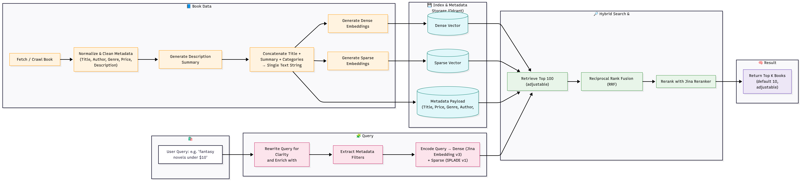

# Book Store Web Application / Ứng Dụng Web Cửa Hàng Sách

<div align="center">
  <a href="#book-store-web-application">English</a> |
  <a href="./README.vi.md">Tiếng Việt</a>
</div>

A comprehensive full-stack book store application featuring a Next.js frontend, NestJS backend, and a hybrid search engine powered by Qdrant and PostgreSQL.

## Table of Contents
- [Project Structure](#project-structure)
- [Architecture Overview](#architecture-overview)
- [Prerequisites](#prerequisites)
- [Setting Up the Application](#setting-up-the-application)
- [Environment Variables](#environment-variables)
- [Running the Application](#running-the-application)

## Project Structure

```
book-store-webapp/
├── docker-compose.yaml                 # Main Docker Compose file for production deployment
├── book-store-backend/                 # NestJS backend API
│   ├── src/
│   │   ├── app.module.ts
│   │   ├── main.ts
│   │   ├── modules/                    # API modules (auth, user, product, etc.)
│   │   ├── core/                       # Core utilities and decorators
│   │   ├── database/                   # Database configuration and migrations
│   │   └── protos/                     # gRPC protocol definitions
│   ├── docker-compose.local.yaml       # Local Docker setup for backend services
│   ├── package.json
│   └── .env.prod                      # Backend environment variables (template)
├── book-store-frontend/                # Next.js frontend application
│   ├── src/
│   │   ├── app/                        # Next.js app router pages
│   │   ├── components/                 # Reusable React components
│   │   ├── features/                   # Feature-based components
│   │   └── provider/                   # Data and auth providers
│   ├── package.json
│   └── .env.prod                      # Frontend environment variables (template)
└── book-store-search-engine/           # gRPC-based hybrid search service
    ├── main.py                         # gRPC server entry point
    ├── retriever/                      # Hybrid search implementation
    ├── query_processor/                # Query processing and filtering
    ├── protos/                         # gRPC protocol definitions
    ├── seeds/                          # Data seeding scripts
    ├── docker-compose.local.yaml       # Local Docker setup for search engine
    ├── requirements.txt
    └── .env.prod                      # Search engine environment variables (template)
```

## Architecture Overview

The application consists of three main components:

1. **Frontend (book-store-frontend)**: A Next.js application built with TypeScript and Tailwind CSS, using the refine framework for admin panel functionality and Shadcn UI components.

2. **Backend (book-store-backend)**: A NestJS API server that handles user authentication, product management, orders, cart functionality, and communicates with both PostgreSQL and the search engine via gRPC.

3. **Search Engine (book-store-search-engine)**: A Python-based service that implements a hybrid search system combining traditional keyword search (sparse vectors) with semantic search (dense vectors) using Qdrant vector database.

### Search Engine Details

The search engine is a Hybrid search engine for book stores, powered by Qdrant for vector search and PostgreSQL for traditional search.



**Architecture:**
- `main.py`: Entry point for the gRPC server
- `query_processor/`: Contains query processing logic
- `retriever/`: Implements retrieval mechanisms
- `protos/`: gRPC protocol definitions
- `requirements.txt`: Python dependencies

**Key Features:**
- Combines dense vector search (semantic understanding) with sparse vector search (keyword-based)
- Uses Qdrant vector database for semantic similarity searches
- Integrates with PostgreSQL for traditional relational queries
- Implements Cross-Encoder re-ranking for better result relevance
- Communicates with the backend via gRPC

### Example Search Query

Try searching for: "Classic children's stories featuring Winnie-the-Pooh and friends"

**Note:** Search time may vary depending on the host machine specifications and network connection.

## Prerequisites

- Docker and Docker Compose v2+
- Git
- An internet connection for downloading dependencies and seed data

## Setting Up the Application

### 1. Clone the repository

```bash
git clone https://github.com/gianghp123/book-store-webapp.git
cd book-store-webapp
```

### 2. Download Seed Files

The application requires seed data to function properly. You'll need to download the following file:

- **book-store-seeds.zip** - Contains all required seed data and environment files for the entire application

Download this file from Google Drive: [Download book-store-seeds.zip](https://drive.google.com/file/d/1wMTSCjj-zWs_cSxcle75-y7c3u6sggPj/view?usp=sharing)

Extract it as follows:

```bash
# After downloading the file
unzip book-store-seeds.zip

mkdir book-store-backend/src/database/seeds

# Copy the content to the appropriate directories
cp -r book-store-seeds/backend_seeds/* book-store-backend/src/database/seeds/
cp -r book-store-seeds/search_engine_seeds/* book-store-search-engine/seeds/

# Copy environment files to their respective directories
cp book-store-seeds/envs/.env.prod.backend book-store-backend/.env.prod
cp book-store-seeds/envs/.env.prod.frontend book-store-frontend/.env.prod
cp book-store-seeds/envs/.env.prod.search_engine book-store-search-engine/.env.prod
```

The `book-store-seeds/` directory structure contains:
- `backend_seeds/` - Initial database data for PostgreSQL (CSV files with books metadata, etc.)
- `search_engine_seeds/` - Vector embeddings and search data for the Qdrant database
- `envs/` - Production environment files for all services

**Note:** You can use the provided environment files directly as they contain free-tier API keys and configurations that should work out-of-the-box.


### 2. Build and Run with Docker Compose

Once the seed files are in place and environment variables are configured, you can start the entire application:

```bash
# From the root directory of the project
docker compose up --build
```

**Note:** The complete startup process may take more than 10 minutes depending on your device's specifications, as it needs to build all services, initialize databases, and load seed data into the vector database.

This command will:
1. Build Docker images for all services
2. Start PostgreSQL, Qdrant, Redis, backend API, search engine, and frontend
3. Run the seed script to populate the Qdrant vector database with the provided embeddings
4. Connect all services together

The application will be available at:
- Frontend: http://localhost:3000
- Backend API: http://localhost:4000
- Qdrant UI: http://localhost:6333
- Redis: localhost:6379 (internal use)

## Environment Variables

The required environment files are included in the `book-store-seeds.zip` file. You can use these directly as they contain free-tier API keys and configurations that work out-of-the-box.

**Example values if you choose to create your own:**

### book-store-backend/.env.prod
```
POSTGRES_USER=your_postgres_user
POSTGRES_PASSWORD=your_postgres_password
POSTGRES_DB=your_database_name
POSTGRES_PORT=5432
POSTGRES_HOST=db

JWT_SECRET=your_jwt_secret_key

FRONTEND_URL=http://localhost:3000
BACKEND_PORT=4000
NODE_ENV=production
```

### book-store-frontend/.env.prod
```
NEXT_PUBLIC_API_URL=http://localhost:4000
API_URL=http://localhost:4000
```

### book-store-search-engine/.env.prod
```
JINAI_API_KEY=your_jina_api_key
CEREBRAS_API_KEY=your_cerebras_api_key
LANGSMITH_TRACING=true
LANGSMITH_ENDPOINT=https://api.smith.langchain.com
LANGSMITH_API_KEY=your_langsmith_api_key
LANGSMITH_PROJECT=book-store-search-engine

POSTGRES_USER=your_postgres_user
POSTGRES_PASSWORD=your_postgres_password
POSTGRES_DB=your_database_name
POSTGRES_PORT=5432
POSTGRES_HOST=db

QDRANT_URL=http://qdrant:6333
QDRANT_GRPC_PORT=6334
QDRANT_PORT=6333

GRPC_PORT=50051

REDIS_HOST=redis
REDIS_PORT=6379
```

**Note:** The environment files provided in the seeds package contain free API keys and can be used directly without modification.

## Running the Application

### Production Mode
```bash
# Build and start all services
docker compose up --build

# Start services in detached mode
docker compose up -d --build

# Stop services
docker compose down
```

### Development Mode
For development, you can run services individually:

**Backend:**
```bash
cd book-store-backend
docker compose -f docker-compose.local.yaml up
npm install
npm run migration:run
npm run start:dev
```

**Frontend:**
```bash
cd book-store-frontend
npm install
npm run dev
```

**Search Engine:**
```bash
cd book-store-search-engine
docker compose -f docker-compose.local.yaml up # Depended on the postgres database in backend docker so you will need to start it first
pip install -r requirements.txt
python -m seeds.add_data_to_qdrant
python main.py
```
