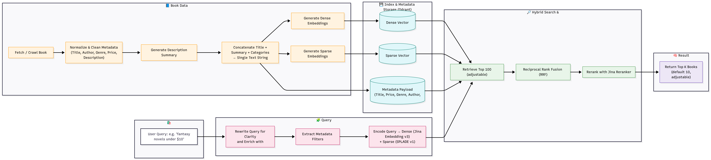

# Ứng Dụng Web Cửa Hàng Sách

Một ứng dụng cửa hàng sách toàn diện gồm giao diện trước Next.js, backend NestJS và công cụ tìm kiếm thông minh được hỗ trợ bởi Qdrant và PostgreSQL.

## Mục Lục
- [Cấu trúc Dự án](#cấu-trúc-dự-án)
- [Tổng quan Kiến trúc](#tổng-quan-kiến-trúc)
- [Yêu cầu Hệ thống](#yêu-cầu-hệ-thống)
- [Thiết lập Ứng dụng](#thiết-lập-ứng-dụng)
- [Biến Môi trường](#biến-môi-trường)
- [Chạy Ứng dụng](#chạy-ứng-dụng)

## Cấu trúc Dự án

```
book-store-webapp/
├── docker-compose.yaml                 # File Docker Compose chính cho triển khai sản xuất
├── book-store-backend/                 # API backend NestJS
│   ├── src/
│   │   ├── app.module.ts
│   │   ├── main.ts
│   │   ├── modules/                    # Các module API (xác thực, người dùng, sản phẩm, v.v.)
│   │   ├── core/                       # Tiện ích và trình trang trí cốt lõi
│   │   ├── database/                   # Cấu hình và các migrations của cơ sở dữ liệu
│   │   └── protos/                     # Định nghĩa giao thức gRPC để giao tiếp với phần thông minh (Python)
│   ├── docker-compose.local.yaml       # Cấu hình Docker cục bộ cho các dịch vụ backend (Postgres)
│   ├── package.json
│   └── .env.prod                      # Biến môi trường backend (bản mẫu)
├── book-store-frontend/                # Ứng dụng giao diện trước Next.js
│   ├── src/
│   │   ├── app/                        # Các trang Next.js app router
│   │   ├── components/                 # Các thành phần React có thể tái sử dụng
│   │   ├── features/                   # Các thành phần theo tính năng
│   │   └── provider/                   # Nhà cung cấp dữ liệu và xác thực
│   ├── package.json
│   └── .env.prod                      # Biến môi trường giao diện trước (bản mẫu)
└── book-store-search-engine/           # Hệ thống tìm kiếm sách thông minh
    ├── main.py                         # Máy chủ gRPC
    ├── retriever/                      # Triển khai tìm kiếm lai
    ├── query_processor/                # Xử lý và lọc truy vấn
    ├── protos/                         # Định nghĩa giao thức gRPC
    ├── seeds/                          # Các script chèn dữ liệu mẫu
    ├── docker-compose.local.yaml       # Cấu hình Docker cục bộ cho công cụ tìm kiếm (Qdrant, Postgres, Redis)
    ├── requirements.txt				# Các thư viện cần thiết
    └── .env.prod                      # Biến môi trường công cụ tìm kiếm (bản mẫu)
```

## Tổng quan Kiến trúc

Ứng dụng bao gồm ba thành phần chính:

1. **Giao diện (book-store-frontend)**: Ứng dụng Next.js được xây dựng bằng TypeScript và Tailwind CSS, sử dụng framework refine cho bảng điều khiển quản trị và các thành phần Shadcn UI.

2. **Backend (book-store-backend)**: Máy chủ API NestJS xử lý xác thực người dùng, quản lý sản phẩm, đơn hàng, chức năng giỏ hàng và giao tiếp với cả PostgreSQL và công cụ tìm kiếm qua gRPC.

3. **Công cụ Tìm kiếm (book-store-search-engine)**: Dịch vụ dựa trên Python triển khai hệ thống tìm kiếm lai kết hợp tìm kiếm từ khóa truyền thống (vector thưa) với tìm kiếm ngữ nghĩa (vector dày) sử dụng cơ sở dữ liệu vector Qdrant.

### Chi tiết Công cụ Tìm kiếm

Công cụ tìm kiếm là công cụ tìm kiếm lai cho các hiệu sách, được hỗ trợ bởi Qdrant cho tìm kiếm vector và PostgreSQL cho tìm kiếm truyền thống.



**Kiến trúc:**
- `main.py`: Điểm nhập cho máy chủ gRPC
- `query_processor/`: Chứa logic xử lý truy vấn
- `retriever/`: Triển khai các cơ chế truy xuất
- `protos/`: Định nghĩa giao thức gRPC
- `requirements.txt`: Các phụ thuộc Python

**Tính năng chính:**
- Kết hợp tìm kiếm vector dày (hiểu ngữ nghĩa) với tìm kiếm vector thưa (dựa trên từ khóa)
- Sử dụng cơ sở dữ liệu vector Qdrant để tìm kiếm tương đồng ngữ nghĩa
- Tích hợp với PostgreSQL để truy vấn quan hệ truyền thống
- Triển khai xếp hạng lại bằng Cross-Encoder để có kết quả liên quan tốt hơn
- Giao tiếp với backend qua gRPC

### Ví dụ

Ví dụ tìm kiếm thông minh với truy vấn: "Classic children's stories featuring Winnie-the-Pooh and friends"

**Note:** Thời gian tìm kiếm có thể phụ thuộc vào thông số máy và kết nối mạng.

## Yêu cầu Hệ thống

- Docker và Docker Compose v2+
- Git
- Kết nối internet để tải các phụ thuộc và dữ liệu mẫu

## Thiết lập Ứng dụng

### 1. Tải repo

```bash
git clone https://github.com/gianghp123/book-store-webapp.git
cd book-store-webapp
```

### 2. Tải về các tệp Dữ liệu Mẫu

Ứng dụng yêu cầu dữ liệu mẫu để hoạt động đúng. Bạn sẽ cần tải về tệp sau:

- **book-store-seeds.zip** - Chứa tất cả dữ liệu mẫu và tệp môi trường cần thiết cho toàn bộ ứng dụng

Tải tệp này từ Google Drive: [Tải book-store-seeds.zip](https://drive.google.com/file/d/1wMTSCjj-zWs_cSxcle75-y7c3u6sggPj/view?usp=sharing)

Giải nén như sau:

```bash
# Sau khi tải về tệp
unzip book-store-seeds.zip

mkdir book-store-backend/src/database/seeds

# Sao chép nội dung đến các thư mục thích hợp
cp -r book-store-seeds/backend_seeds/* book-store-backend/src/database/seeds/
cp -r book-store-seeds/search_engine_seeds/* book-store-search-engine/seeds/

# Sao chép các tệp môi trường đến thư mục tương ứng
cp book-store-seeds/envs/.env.prod.backend book-store-backend/.env.prod
cp book-store-seeds/envs/.env.prod.frontend book-store-frontend/.env.prod
cp book-store-seeds/envs/.env.prod.search_engine book-store-search-engine/.env.prod
```

Cấu trúc thư mục `book-store-seeds/` chứa:
- `backend_seeds/` - Dữ liệu cơ sở ban đầu cho PostgreSQL (các tệp CSV với siêu dữ liệu sách, v.v.)
- `search_engine_seeds/` - Vector nhúng và dữ liệu tìm kiếm cho cơ sở dữ liệu Qdrant
- `envs/` - Các tệp môi trường sản xuất cho tất cả các dịch vụ

**Lưu ý:** Bạn có thể sử dụng các tệp môi trường được cung cấp trực tiếp vì chúng chứa các khóa API và cấu hình dùng thử miễn phí và hoạt động ngay lập tức.


### 3. Xây dựng và chạy với Docker Compose

Sau khi các tệp mẫu được đặt vào đúng vị trí và các biến môi trường được cấu hình, bạn có thể bắt đầu toàn bộ ứng dụng:

```bash
# Từ thư mục gốc của dự án
docker compose up --build
```

**Lưu ý:** Quá trình khởi động hoàn tất có thể mất hơn 10 phút tùy thuộc vào thông số kỹ thuật thiết bị của bạn, vì nó cần xây dựng tất cả các dịch vụ, khởi tạo cơ sở dữ liệu và tải dữ liệu mẫu vào cơ sở dữ liệu vector.

Lệnh này sẽ:
1. Xây dựng Docker Image cho tất cả các dịch vụ
2. Bắt đầu PostgreSQL, Qdrant, Redis, API backend và frontend
3. Chạy script chèn dữ liệu để điền dữ liệu vector cho cơ sở dữ liệu Qdrant với các vector nhúng đã cung cấp
4. Kết nối tất cả các dịch vụ với nhau

Ứng dụng sẽ có sẵn tại:
- Giao diện trước: http://localhost:3000
- API Backend: http://localhost:4000
- Giao diện Qdrant: http://localhost:6333
- Redis: localhost:6379 (sử dụng nội bộ)

## Biến Môi trường

Các tệp môi trường cần thiết được bao gồm trong tệp `book-store-seeds.zip`. Bạn có thể sử dụng các tệp này trực tiếp vì chúng chứa các khóa API dùng thử miễn phí và cấu hình hoạt động ngay lập tức.

**Giá trị ví dụ nếu bạn chọn tạo riêng:**

### book-store-backend/.env.prod
```
POSTGRES_USER=ten_dang_nhap_postgres_cua_ban
POSTGRES_PASSWORD=mat_khau_postgres_cua_ban
POSTGRES_DB=ten_co_so_du_lieu_cua_ban
POSTGRES_PORT=5432
POSTGRES_HOST=db

JWT_SECRET=chuoi_bao_mat_jwt_cua_ban

FRONTEND_URL=http://localhost:3000
BACKEND_PORT=4000
NODE_ENV=production
```

### book-store-frontend/.env.prod
```
NEXT_PUBLIC_API_URL=http://localhost:4000
API_URL=http://localhost:4000
```

### book-store-search-engine/.env.prod
```
JINAI_API_KEY=khóa_api_jina_của_bạn
CEREBRAS_API_KEY=khóa_api_cerebras_của_bạn
LANGSMITH_TRACING=true
LANGSMITH_ENDPOINT=https://api.smith.langchain.com
LANGSMITH_API_KEY=khóa_api_langsmith_của_bạn
LANGSMITH_PROJECT=book-store-search-engine

POSTGRES_USER=ten_dang_nhap_postgres_cua_ban
POSTGRES_PASSWORD=mat_khau_postgres_cua_ban
POSTGRES_DB=ten_co_so_du_lieu_cua_ban
POSTGRES_PORT=5432
POSTGRES_HOST=db

QDRANT_URL=http://qdrant:6333
QDRANT_GRPC_PORT=6334
QDRANT_PORT=6333

GRPC_PORT=50051

REDIS_HOST=redis
REDIS_PORT=6379
```

**Lưu ý:** Các tệp môi trường được cung cấp trong gói seeds chứa các khóa API miễn phí và có thể được sử dụng trực tiếp mà không cần chỉnh sửa.

## Chạy Ứng dụng

### Chế độ Sản xuất
```bash
# Xây dựng và bắt đầu tất cả các dịch vụ
docker compose up --build

# Bắt đầu các dịch vụ ở chế độ nền
docker compose up -d --build

# Dừng các dịch vụ
docker compose down
```

### Chế độ Phát triển
Để phát triển, bạn có thể chạy từng dịch vụ riêng biệt:

**Backend:**
```bash
cd book-store-backend
docker compose -f docker-compose.local.yaml up
npm install
npm run migration:run
npm run start:dev
```

**Frontend:**
```bash
cd book-store-frontend
npm install
npm run dev
```

**Search Engine:**
```bash
cd book-store-search-engine
docker compose -f docker-compose.local.yaml up # Depended on the postgres database in backend docker so you will need to start it first
pip install -r requirements.txt
python -m seeds.add_data_to_qdrant
python main.py
```
